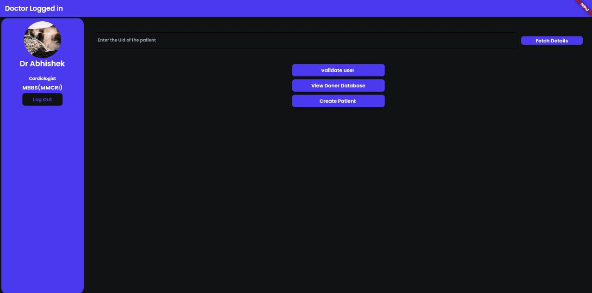
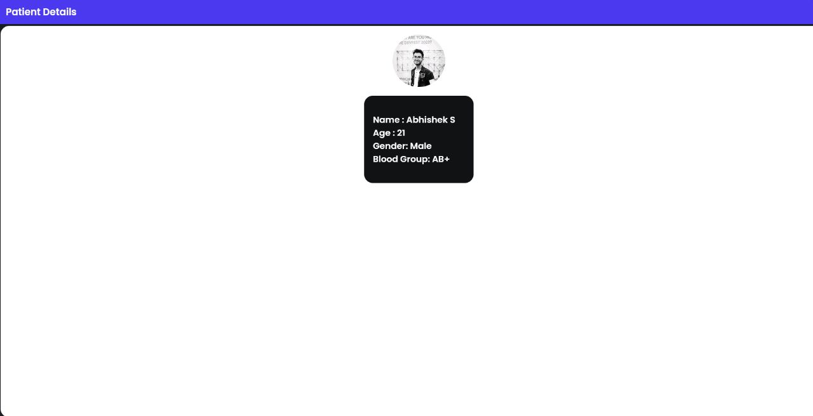

# **DocNet**
```
A one stop solution to view Medical records with authorisation of patients, creating network of Doctors and Medical practioners globally, blockchain implementation to prevent tampering of Records and a universal Framework for calculating a medical Score which defines the Health Status of a person.
```

<!-- ## Softwares and Requirements

---
```
1. Flutter
``` -->
###  **Frontend**
---
## **Backend**
``` 
Flutter - for the Interface

 ``` 

### **Backend**

1. **Algorithm to calculate health Score**
#### 
```
python - 3.10

Parameters Required.

Patients...
1. Age.
2. Body Mass Index.
3. Family Diseases.
4. Any Pre Exisiting Diseases.
5. Habits (Smoking,Eats Tobacco, Alcoholic).


Algorithm will take the above parameters from the backend to calculate Health Score of the patient.
```
2. **Smart Contracts**
```
Solidity Compiler - 0.7.0 < 0,9.0
REMIX IDE


Smart Contracts methods :
  1. Add Patients Details.
  2. Fetch Patients Details.
  3. Update file Hash of the Patients. 
  4. Validate file Hash.
```
3. **Database**
```
Firebase - Cloud Firestore

Cloud Firestore is used to store:
  1. Patient Details(Profile,Documents,Health Score)
  2. Doctors Profile.
  3. Donor Database.

```

# Snapshots

## Doctor Login


'''
Login credential: akash@email.com
password 123456
'''

## Home Screen



## View Patient


